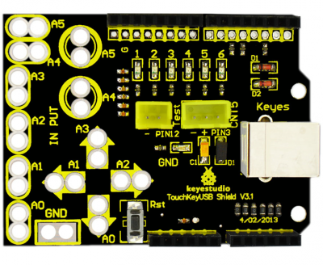
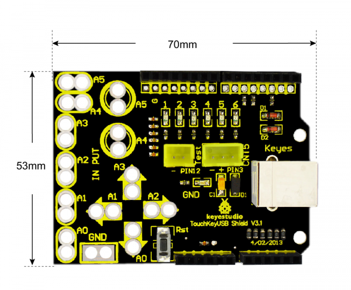
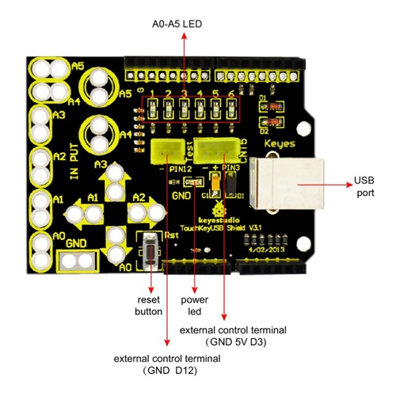
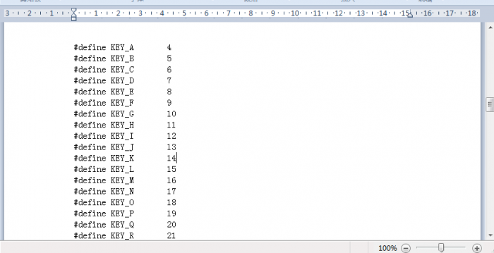
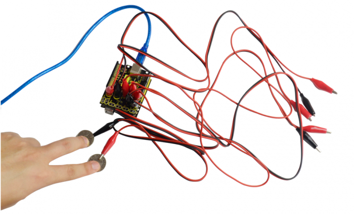
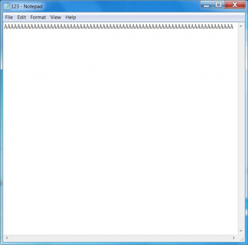

# KS0147 keyestudio Touch Key USB shield



## 1. Introduction

Have you seen the Makey touch keyboard simulation? MaKey  is a very simple circuit board that can make any objects as a computing input device.

That’s to say, it can make stairway into a piano, bananas into a keyboard, plasticine into a joystick or even your families into a musical synthesizer.

The principle is simple. It uses ARDUINO microcontroller to simulate a keyboard, and lead out several keys, replacing the switch with touch key. This Touch Key USB Shield is developed by KEYESTUDIO.

The shield uses touch input, namely, a double-contact switch, leading out touch port and ground connected to two touch electrodes. Because of body-resistance, when you touch the two electrodes, there is certain current flowing through between them, so can detect the touch event through the current detection.

More reference see the keyestudio Maker Touch Starter Kit

## 2. Features

- Compatible with UNO R3and MEGA 2560 control board
- XP and win7 system Drive-free auto-identification
- Identify six buttons at most
- Operating voltage: DC 5V
- Can set the 6 buttons output in the code
- Onboard comes with 2 anti-reversed interfaces, used to connect other devices.


## 3. Technical Details

- Dimensions: 70mm x 53mm x 26mm
- Weight: 19.8g



## 4. PINOUT



## 5. Test Code

**Library files and code download：**[Resources](./Resources.7z)

```
#include "UsbKeyboard.h"
int InData1 = 0, InData2 = 0, InData3 = 0, InData4 = 0, InData5 = 0, InData0 = 0; //touch input value
//temporary storage
int TouchSensitivity = 20; //touch sensitivity. 0~1023，the larger the value, the lower the sensitivity.
void setup()
{
    for(int i = A0; i <= A5; i++)
    {
    	pinMode(i, INPUT); //A0~A5 port as input port
    }
    for(int i = 6; i <= 12; i++)
    {
    	pinMode(i, OUTPUT); //A0~A5 port as input port
    }
    TIMSK0 &= !(1 << TOIE0);
}

void loop()
{
    UsbKeyboard.update();
    //read out the voltage value of all pins, and because of pull-up resistor，
    //the default of all pins of maximum level is 1023，decrease the level of pins though touch.
    //so the value is by 1024-analogRead(A0);
    InData0 = 1024 - analogRead(A0);
    InData1 = 1024 - analogRead(A1);
    InData2 = 1024 - analogRead(A2);
    InData3 = 1024 - analogRead(A3);
    InData4 = 1024 - analogRead(A4);
    InData5 = 1024 - analogRead(A5);
    //trigger keyboard events with various possibility
    if(InData0 >= TouchSensitivity)
    {
        digitalWrite (11, HIGH);
        UsbKeyboard.sendKeyStroke(4); //A
    }
    else 
    	digitalWrite(11, LOW);
    if(InData1 >= TouchSensitivity)
    {
        digitalWrite(10, HIGH);
        UsbKeyboard.sendKeyStroke(5); //B
    }
    else 
    	digitalWrite(10, LOW);
    if(InData2 >= TouchSensitivity)
    {
    digitalWrite(9, HIGH);
    UsbKeyboard.sendKeyStroke(6); //C
    }
    else digitalWrite(9, LOW);
    if(InData3 >= TouchSensitivity)
    {
        digitalWrite(8, HIGH);
        UsbKeyboard.sendKeyStroke(7); //D
    }
    else 
    	digitalWrite(8, LOW);
    if(InData4 >= TouchSensitivity)
    {
        digitalWrite(7, HIGH);
        UsbKeyboard.sendKeyStroke(8);//E
    }
    else 
    	digitalWrite(7, LOW);
    if(InData5 >= TouchSensitivity)
    {
        digitalWrite(6, HIGH);
        UsbKeyboard.sendKeyStroke(9);//F
    }
    else 
    	digitalWrite(6, LOW);
    delay(100);
}
```

**Code to Note**

1.Before compile the code, do remember to add the necessary libraries inside the libraries directory of Arduino IDE.

**2.** In the code **UsbKeyboard.sendKeyStroke(9)**, here you can change the value to make 6 buttons output different value. The detailed value you can find in the **UsbKeyboard.h** file, as the figure shown below.



## 6. Example Use

Upload well the code to UNO R3, then stack the shield onto UNO R3. Connect the alligator clip line to both GND and A0-A5 interfaces, and clip the coin to GND and A0 connected to alligator clip line.



Then connect the shield to computer (WIN7) using a USB cable, the computer will automatically identify the shield.

Open a Notepad, when your fingers touch the two coins, the letter A will continue to display on the text.



If use your fingers to separately touch the coin connected to GND and one end of A1-A5 alligator clip line, the letter BCDEF will display on the text.